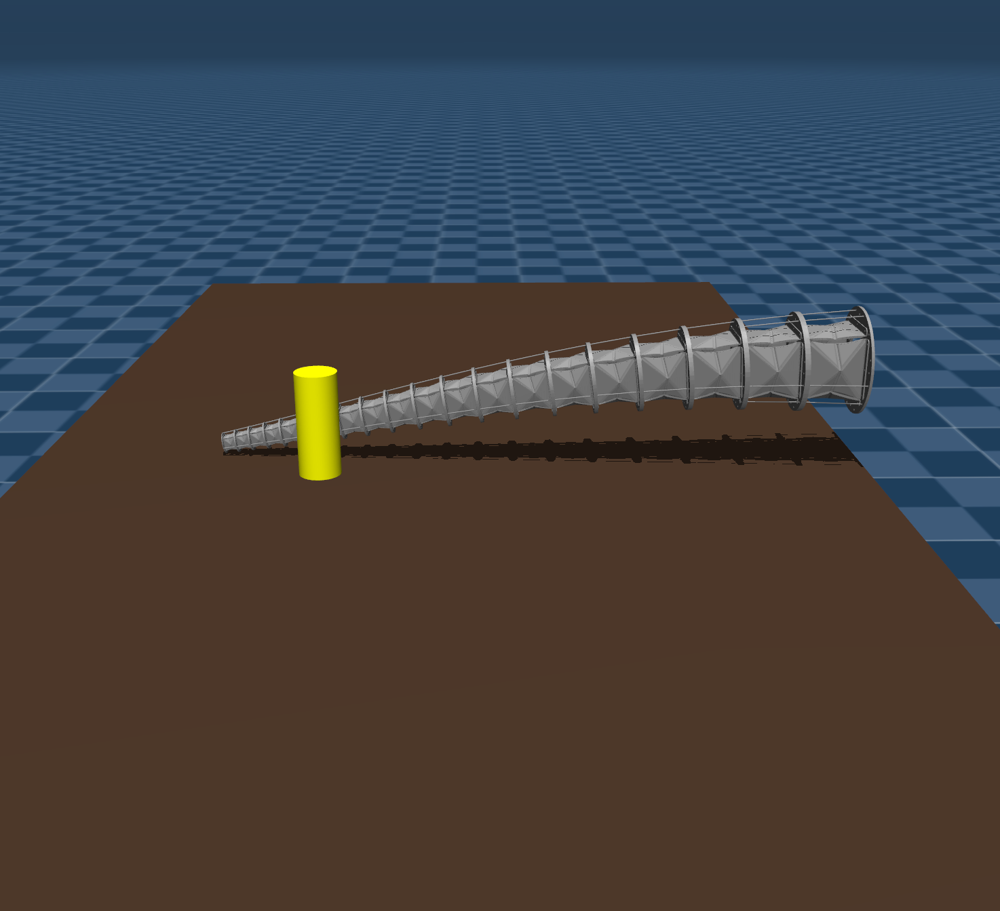
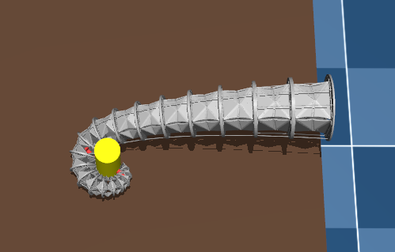

# modular-origami-soft-robot-mujoco
A MuJoCo-based framework for soft robotic arm modeling, physics simulation, and grasping experiments with contact-force analysis.

## Overview

The goal of this project is to build a simulation pipeline for a soft robotic arm, enabling:

- **Soft robotic arm modeling**
  - Build a multi-segment soft/continuum-like robotic arm model in MuJoCo.
- **Physics simulation**
  - Simulate deformation-related motion, actuation, and object interaction using MuJoCo dynamics.
- **Grasping task validation**
  - Test whether the robotic arm can approach, contact, and grasp target objects.
- **Actuator control**
  - Support rope/tendon-like actuation for driving arm motion.
- **Contact force analysis**
  - Extract and visualize contact forces during object interaction and grasping.

## Project Structure

```text
.
├── xml/                    # XML templates and generated MuJoCo models
├── py/                     # intermediate scripts for model generation/assembly
├── STL/                     # STL mesh files for the robot and grasped objects (not included in this repository)
├── merge.py                # model generation and XML assembly pipeline
├── compute.py            # simulation, control, and contact-force visualization
└── README.md
```

## Simulation Result

<p>
  The image shows the initial posture of the soft robotic arm in the simulation.  
</p>

<p align="center">
  
</p>

<p>
  The image shows the robotic arm grasping the target object.
</p>

<p align="center">
  
</p>
